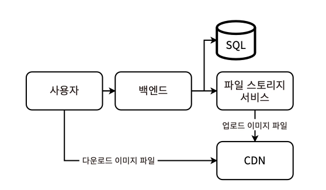
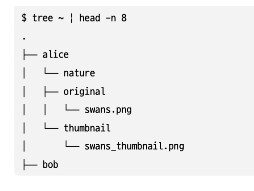
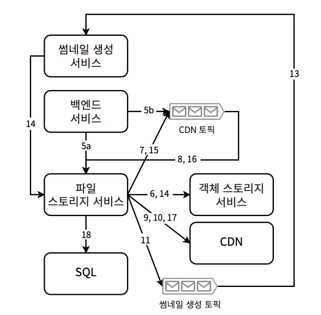
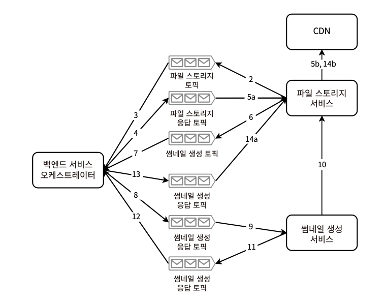

# 12장. 플리커 설계

> 파일/이미지 공유 서비스 설계
> 
- 파일/이미지 공유
- 접근 제어
- 댓글
- 즐겨찾기 등의 메타데이터

→ 모든 소셜 애플리케이션의 기본 기능. 10억 명의 사용자 간 이미지 공유와 상호작용을 위한 분산 시스템 설계를 다룬다.

## 사용자 스토리와 기능 요구사항

- 사용자
    1. 뷰어 - 다른 사용자가 공유한 사진 조회
    2. 공유자 - 사진 업로드
- 너비 50px의 썸네일 생성 및 표시 → 그리드 형태로 여러 사진 목록 노출, 한 번에 하나씩 선택해 전체 해상도 조회
- 공유자는 자신의 사진에 대한 접근 제어 가능 - 개별 사진 단위 vs **뷰어 단위**
- 공유자는 미리 정의된 메타데이터 필드 값을 제공한다 (e.g. 위치, 태그 등)
- 동적 메타데이터도 제공 (e.g. 파일 읽기 권한이 있는 뷰어 목록)
- 사진 댓글 기능 (공유자가 on/off 가능), 댓글 알림 기능
- 사진 즐겨찾기 기능
- 사진 검색 기능 (제목, 설명)
- 사진 다운로드 기능 *프로그래밍 방식
    - 사진 보기 = 사진 다운로드로 간주
- 개인화

### 논의하지 않는 것

- 사진 메타데이터로 사진 필터링하기
- 위치(GPS), 시간, 카메라 세부 정보(OS) 등 클라이언트가 기록하는 사진 메타데이터
- 비디오

## 비기능적 요구사항

- 예상되는 사용자 수, API를 통한 다운로드 수
    - 전 세계에 분산된 10억 명의 사용자
    - 사용자의 1%가 매일 10개의 고해상도(10MB) 이미지를 업로드한다고 가정 ⇒ 매일 1PB의 업로드, 10년동안 3.65EB
    - 평균 트래픽 - 초당 1GB 이상 / 급증을 고려하여 초당 10GB로 계획
- 사진 및 댓글 업로드 / 사진 삭제 / 개인정보 설정 변경의 즉시 반영 여부
    - 일관성, 지연시간은 트레이드오프. 최종 일관성 허용
    - 삭제된 사진이 모든 스토리지에 반영되기까지 몇 시간 정도는 허용하나, 몇 분 내에 모든 사용자가 접근할 수 없어야 함
    - 개인정보 설정은 더 빠르게 적용되어야 함
- 고해상도 사진의 높은 네트워크 속도과 비용 통제
    - 한 번에 하나의 고해상도 사진만 다운로드 가능하도록 제한
    - 저해상도의 썸네일은 동시에 여러 개 다운로드 가능
    - 파일 업로드는 한 번에 하나씩으로 제한
- 사진 다운로드/업로드가 중단되어서는 안 됨 ⇒ 99.999% 가용성
- 썸네일 다운로드는 P99 ≤ 1s의 성능, 낮은 지연시간을 요구하지만, 고해상도에는 적용X
- 업로드의 높은 성능은 필요하지 않음

### 썸네일 생성 방식

1. 클라이언트가 썸네일을 요청할 때마다 서버가 전체 해상도 이미지에서 썸네일을 생성하는 것
    - 전체 해상도 이미지 파일은 수십 MB 이므로, 뷰어의 요청마다 10개의 썸네일 그리드를 요청한다고 할 때 P99 1s 보다 더 짧은 시간에 100MB 이상의 데이터를 처리해야 함
    - 비용이 매우 많이 들고, 저장소와 처리가 같은 서버에서 이뤄져야만 가능
2. 파일이 업로드된 직후, 썸네일을 생성하고 저장 → 뷰어가 요청할 때 썸네일을 제공하는 것
    - 처리와 저장을 별도 서비스에서 처리하도록 기능적 분할이 가능함
    - 썸네일은 몇 KB 수준이므로 저장 비용이 낮음
3. b + 썸네일, 전체 해상도 이미지 파일을 모두 클라이언트에 캐시하기

**CSS img 태그의 width, height 속성, 모바일 앱의 마크업 태그도 가능하다 네트워크 비용이 높고 확장성이 떨어져 고려 X*

## 고수준 아키텍처

- 사용자는 CDN에서 직접 이미지 파일을 다운로드할 수 있다
- CDN으로의 업로드는 별도의 분산 파일 저장 서비스를 통해 버퍼링될 수 있다

**[구성]**

1. 이미지 파일, 메타데이터(JSON/YAML)를 위한 CDN
    
    **대부분 서드파티 서비스 활용*
    
2. 공유자가 이미지 파일을 업로드하기 위한 별도의 분산 **파일 저장 서비스**
    - CDN과의 상호작용 처리
    - SLA 계약에 따라 CDN이 여러 데이터센터로 이미지를 복제하는 데 최대 몇 시간이 걸릴 수 있음
    - 많은 뷰어의 다운로드 요청이 몰릴 때, 이미지 다운로드 속도가 느려질 수 있음
    - 이미지 파일 업로드 역시 지연 시간이 공유자에게 허용할 수 없을 정도로 느려질 수 있음 (CDN이 여러 공유자 요청을 처리하지 못하는 경우)
    - 파일을 CDN에 업로드한 뒤, 파일 저장 서비스에서 삭제하거나 백업으로 유지할 수 있음 (CDN 장애에 대비해 fallback으로 보존하는 것을 권장)

## CDN에서 디렉터리와 파일 구성하기

> 디렉터리 계층 구조 - 사용자 > 앨범 > 해상도 > 파일 > (날짜)
> 
- **각 사용자에는 고유한 자신의 CDN 디렉터리가 할당된다.**
    - 주요 쿼리 패턴 - 사용자ID와 해상도로 사진 조회
- 앨범 디렉터리는 다양한 해상도의 여러 이미지 파일(메타데이터 포함)을 각각 고유한 디렉터리에 저장한다.
    

## 사진 업로드하기

### 썸네일 생성

1. 클라이언트 사이드
    - 백엔드의 계산 리소스 절약
    - 네트워크 트래픽 영향 거의 X
    - 업로드 전에 썸네일이 이미 CDN에 업로드되었는지 확인 가능
    - 업로드 과정 : 썸네일 생성 → 압축 (gzip, brotli) → CDN에 업로드 → 디스크에 기록 후 다른 데이터 센터로 복제
        - CDN 요청 본문 - 업로드되는 이미지 수, 해상도를 설명하는 JSON 문자열
    - 클라이언트 기기의 다양한 환경을 제어하고 디버깅 재현이 어렵다는 한계가 있음
    - 서버보다 실패 시나리오 多 (e.g. 클라이언트 하드디스크 공간 부족, 다른 애플리케이션의 과부하 영향, 네트워크 연결 등)
    - 서버보다 무엇을 로깅해야 할지 결정하기가 어려움
    - 지루하고 긴 SW 릴리즈 수명 주기
        https://commons.wikimedia.org/w/index.php?curid=6818861
        
        - 점진적 마이그레이션의 한계 (새로운 함수 개발 후 동일한 input으로 기존 버전과 동시 운영하는 방식)
            1. 이전 버전과 호환되지 않는 코드를 도입하기는 어려움
            2. 코드베이스가 더 커지고 유지보수가 어려워짐
            3. 클라이언트의 많은 계산 리소스와 에너지를 소비함
            4. 클라이언트 앱의 크기를 증가시킴
2. 서버 사이드
    - 동일한 언어, 도구로 서비스 운영 가능
    - 썸네일 생성 과정
        1. 파일 업로드 여부 확인 (중복 업로드 방지 목적)
        2. 파일 → 파일 저장 서비스와 CDN에 업로드
        3. 썸네일 생성 → 파일 저장 서비스와 CDN에 업로드  ***(2) 완료 시, 스트리밍 작업 트리거**
    - 파일 저장 서비스 = CDN에 업로드하기 위한 버퍼/fallback/백업용으로 사용
        - 데이터센터 내 호스트 간 복제에서만 사용 (서로 다른 데이터센터 간 X)
    
    [구현 방식]
    
    1. **코레오그래피 사가 패턴**을 이용해 파일 업로드 비동기 처리하기
        
        
        
        1. 이미지를 해싱한 후 백엔드에 업로드 여부 확인 (중간에 파일 저장 서비스나 백엔드의 연결이 실패하더라도 중복 업로드를 하지 않도록 하기 위함)
        2. 백엔드 → 파일 저장 서비스의 처리 후 응답
            1. 저장 성공 - 카프카 토픽에 썸네일 생성 이벤트 생성
            2. 저장 실패 - 백엔드를 통해 파일 저장 서비스에 (파일 압축 후) 업로드
        3. 파일 저장 서비스 → 파일을 객체 저장 서비스에 기록
        4. 파일 저장 서비스 → CDN 카프카 토픽 이벤트 생성
        5. 파일 저장 서비스 → 이미지 해시를 통해 CDN 업로드 여부 확인 (체크포인트 기준)
        6. 파일 저장 서비스 → 파일을 CDN에 업로드 (비동기로 수행되므로 느리더라도 사용자에 영향 X)
        7. 파일 저장 서비스 → 파일ID를 포함해 썸네일 생성 이벤트 생성 → 카프카 서비스로부터 성공 응답 ✅ **피벗 트랜잭션**
            
            ***** 여기까지 보상 트랜잭션 범위 ***  — 파일 저장 서비스의 업로드 속도는 썸네일 생성 요청 속도를 제한한다 (요청 과부하가 방지됨)**
            
        8. 백엔드 → 이미지 파일 업로드 성공 응답을 사용자에게 반환 **(썸네일 생성 이벤트 생성됨을 보장)**
        9. 썸네일 생성 서비스 → 이벤트 소비 후 파일 저장 서비스에서 파일을 가져와 썸네일 생성 → 파일 저장 서비스를 통해 객체 저장 서비스에 기록
        10. 썸네일 생성 서비스 → 파일 저장 서비스가 CDN에 썸네일을 기록하도록 CDN 토픽에 *ThumbnailCdnRequest* 기록
            - 직접 CDN에 기록하지 않는 이유는 CDN과 통신하는 복잡성을 최소한의 서비스로 집중시키기 위함 (파일을 받을 준비가 되었는지 주기적으로 체크, 저장 공간이 부족해지지 않도록 조치, 보안 유지보수 등)
        11. 파일 저장 서비스 → CDN 토픽에서 이벤트 소비 후 객체 저장 서비스에서 썸네일 조회 
            
            ***** 8~11의 썸네일 생성 트랜잭션은 재시도 가능한 트랜잭션 (이미지 파일 데이터를 보유하고 있기 때문) ***** 
            
        12. 파일 저장 서비스 → 썸네일을 CDN에 기록 → CDN은 파일 키를 반환  *실제로는 CDN에 기록하고 반환받는 과정이 오래 걸리므로 여러 번 재시도할 수 있음
        13. 파일 저장 서비스 → 파일 키-사용자ID 매핑을 SQL 테이블에 저장
        14. CDN이 고해상도와 썸네일 이미지 파일을 제공하는 속도에 따라 파일 저장 서비스에서 즉시 삭제 or 1시간 전에 생성된 파일 삭제 배치 ETL을 구현할 수 있음
    2. **오케스트레이션 사가 패턴**을 이용해 파일 업로드, 썸네일 생성 처리하기
        
        
        
        1. 백엔드에 이미지 업로드 여부 확인
        2. 백엔드 → 파일 저장 서비스를 통해 객체 저장 서비스에 업로드
        3. 백엔드 → 파일 저장 응답 토픽에서 이벤트 소비
        4. 백엔드 → CDN에 파일 업로드 요청하는 이벤트를 CDN 토픽에 생성
        5. 파일 저장 서비스 → CDN 토픽에서 소비 & 파일을 CDN에 업로드
        6. 백엔드 → CDN 응답 토픽 소비 후 썸네일 생성 요청 토픽에 생성
        7. 썸네일 생성 서비스 → 파일 저장 서비스에서 파일을 가져와 썸네일 생성 → 파일 저장 서비스에 기록
        8. 썸네일 생성 서비스 → 썸네일 생성 성공 이벤트를 파일 저장 토픽에 생성
        9. 파일 저장 서비스 → 파일 저장 토픽 이벤트 소비 후 썸네일을 CDN에 업로드
3. 클라이언트, 서버 양쪽에 구현
    - 서버 사이드 생성은 클라이언트 사이드 생성의 failover 역할로서 동작
        - 클라이언트 특정 버전에 버그가 있어 생성에 실패한 경우 → 서버 사이드 생성 수행
    - 클라이언트 사이드 버그와 충돌 비용이 덜 들기 때문에, 클라이언트 사이드 생성만 하는 것보다 더 저렴하고 쉬울 수 있음

[관련된 상세 구현]

- 압축 알고리즘
- 암호화 보안 해싱 알고리즘
- 인증 알고리즘
- 픽셀 MB 변환
- 사진 업로드 통신
    - HTTP POST
    - RPC
    - FTP - 디스크에 기록하므로, 디스크 → 메모리로 읽는 지연 시간과 CPU 리소스가 발생함.
        - 파일 압축 시, 압축을 풀기 위해 디스크 → 메모리 로드 과정 수반

## 이미지와 데이터 다운로드하기

- 동적 콘텐츠는 업데이트되거나 삭제될 수 있으므로 CDN이 아닌 SQL에 저장
    - e.g. 사진 댓글, 사용자 프로필 정보, 사용자 설정
- 인기 있는 썸네일/전체 해상도 이미지 → Redis 캐시
    - 저장공간이 충분할 경우, 클라이언트에 캐시
    - ⇒ 서버 리소스 없이 즉시 즐겨찾는 이미지 그리드를 내려줄 수 있음
- API 페이지네이션에 버전을 부여해 연속된 썸네일 10개씩 조회하게 할 수 있다

## 기타 서비스

- 프리미엄 기능
    - 사진 다운로드에 비용을 지불하게 하는 판매 시스템 설계
    - 판매 기록 및 사진 소유권 추적 필요
    - 판매 지표, 대시보드, 분석, 판매 가격 책정 추천 기능 등
    - 다양한 구독 플랜 고려
- 결제와 세금 서비스
    - 사용자와의 거래 및 결제 관리
    - 다양한 종류의 세금 및 정책 (특정 제품/산업의 면세 규정 등) 고려가 필요한 복잡한 주제로 이어짐
- 검열/콘텐츠 조정
    - 공개 범위에 관계없이 부적절하거나 공격적인 콘텐츠를 감독하고 제거하는 프로세스 필요
    - 콘텐츠 조정 시스템 설계 - 신고, 삭제, 경보, 차단 관리 (수동 / 자동 수행)
        - 법적 이슈와 연관
- 광고
    - 클라이언트에 서드파티 광고 SDK(e.g. Google Ads)를 추가하는 방식이 가장 일반적
    - 공유자를 위한 광고 표시 시스템 설계
        - 사진 판매를 늘리기 위한 마케팅 전략 - e.g. 홈페이지에 자신의 사진 노출
    - 광고 없는 경험을 대가로 유료 구독 패키지 제공
- 개인화
    - 앱 내 활동, 기타 출처에서 획득한 사용자 데이터를 기반으로 개인화된 광고, 검색, 콘텐츠 추천 제공

## 기타 논의 주제

- 사진 메타데이터에 ElasticSearch 인덱스 생성
- 더 세분화된 이미지/사용자 프로필 접근 권한 제어
- 사진을 구성하는 더 많은 방법 - e.g. 그룹 내 공유 기능, 사진 컬렉션 패키징
- 저작권 관리, 워터마킹 시스템
- 데이터 손실, 예방, 해소 (+보안 침해, 데이터 도난)
- 이미지 파일의 저장 비용 제어
- 분석 목적의 배치 파이프라인
- 사용자 간 팔로우, 사진/댓글 알림 기능
- 오디오/비디오 스트리밍 지원
