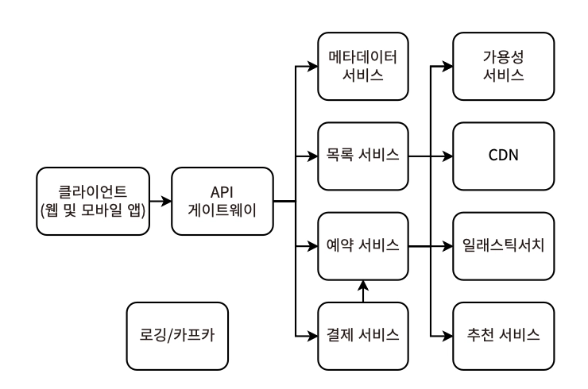
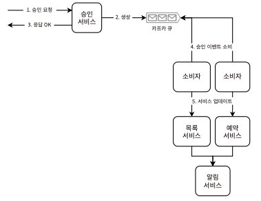
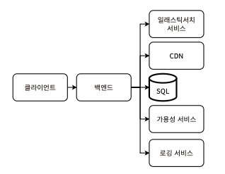

# 15장. 에어비앤비 설계

> 단기 숙박을 위한 방을 임대할 수 있는 서비스 설계 (숙박 외 도메인에도 모두 적용 가능)
> 

## 요구사항

- 마켓플레이스 앱 - 제품과 서비스를 판매하는 사람과 구매하는 사람을 연결한다
- 사용자 유형
    1. 게스트 - 한정된 항목을 예약
        - 사용 사례
            - 목록 검색 및 조회
            - 예약 요청, 결제 처리
            - 호스트와의 소통
            - 목록/호스트 평점, 리뷰 게시
            - 조정 요청, 사기 신고 등의 운영팀과 커뮤니케이션 지원
    2. 호스트 - 항목의 목록을 생성
        - 사용 사례
            - 온보딩, 업데이트로 목록 CUD
                
                예약 기간의 최소/최대, 요일 등 기준에 따른 가격 조정, 가격 추천 제안, 특정 지역 규정 적용 등 여러 복잡한 비즈니스 로직이 얽혀있음
                
            - 예약 처리 (요청 수락/거부)
                - 요청 처리 전 게스트의 평점, 리뷰 조회
                - 특정 기준에 따라 자동 수락 옵션 제공
                - 예약 수락 후 취소 시 정책 (금전적 패널티, 권한 정지 등)
            - 게스트와의 소통창구 - 앱 내 메시징
            - 게스트 평점, 리뷰
            - 게스트의 숙박비 지불 처리
            - 세금 신고 문서
            - 시간에 따른 수입, 평점, 리뷰 분석
            - 조정 요청, 사기 신고 등의 운영팀과 커뮤니케이션 지원
    3. 운영팀
        - 결제를 처리하고 수수료를 받는다
            - 분쟁 조정
            - 사기 모니터링
            - 고객 지원 담당, 운영 담당 내부 사용자(ops) 존재
            
            → 설계에서는 호스트, 게스트, 운영, 분석의 사용자를 다룬다
            
        - 사용 사례
            - 목록 요청 검토, 부적절한 목록 제거
            - 분쟁 조정, 대체 목록 제안, 환불 전송 등 고객과 소통
- 결제 수단
    - 현금, 직불카드/신용카드 처리업체 (API), 온라인 결제 처리업체, 수표, 스토어 크레딧, 특정 회사/국가에 특화된 결제 카드/기프트 카드, 암호화폐
    - → 매우 다양하며, 각 유형과 회사에 따라 수수료, 세금 등의 규정이 모두 상이함

### 기능적 요구사항

- 숙소
    - 호스트의 방 등록 (속성 - 도시, 가격, 사진/영상) - 1인용으로 가정. 최대 10장의 사진, 25MB의 동영상
    - 게스트의 방 검색
        - 필터링 조건 - 도시, 체크인, 체크아웃 날짜
- 예약
    - 특정 날짜에 하나의 방만 예약 가능
    - 예약 시작 전에는 언제든 예약 취소 가능
    - 게스트, 호스트의 자신의 예약 목록 조회
    - 방은 중복 예약될 수 없음
- ❌ 단순화를 위해 제외될 기능
    - 호스트의 수동 예약 수락/거부 허용
    - 예약 후 취소는 다루지 않음
    - 게스트와 호스트 알림(푸시, 이메일 등)에 대해 깊이 다루지 않음
    - 게스트-호스트, 운영팀-게스트/호스트 간 등 사용자 간 메시징
- 세부 고려사항
    - 숙소의 기타 세부 사항
        - 정확한 주소, 도시 문자열만 필요로 함
        - 모든 목록은 한 명의 게스트만 허용
        - 집 전체 vs 개인실 vs 공용실 → 케이스별 처리
        - 개인 욕실 vs 공용 욕실, 주방 등 편의 시설 세부 정보
        - 어린이 친화적
        - 반려동물 동반 가능 여부
    - 분석
    - 호스트에 가격 추천 제공, 최소/최대 가격 설정 및 변경 지원
    - 청소 비용, 기타 수수료, 성수기, 세금 등 추가 가격 옵션
    - 취소 위약금을 포함한 결제 or 환불
    - 분쟁 조정 등 고객 지원
    - 보험
    - 호스트-게스트 등 당사자 간 채팅 (메시징, 알림 서비스)
    - 회원가입과 로그인
    - 서비스 중단에 대한 호스트, 게스트 보상
    - 사용자 리뷰 - 숙박 리뷰, 게스트의 행동 리뷰

### 비기능적 요구사항

- 10억 개의 방, 1억 건의 일일 예약으로 확장 가능
    - 과거 예약 데이터 삭제 가능
    - 프로그래밍 방식으로 생성된 사용자 데이터 X
- 예약과 같이 목록 가용성에 강한 일관성 적용 ⇒ 이중 예약, 이용 불가능한 날짜의 예약 노출, 예약 손실 방지
- 예약 손실의 경우, 금전적 결과가 따르므로 높은 가용성을 적용
- 높은 성능 불필요 (P99 = ns)
- 일반적인 보안, 프라이버시 요구사항 필요
    - 사용자 데이터 비공개

## 설계 결정

- 방 목록 정보의 **복제**
    - 검색은 한 번에 한 도시에서만 가능
    - 쓰기 성능이 중요하지 않으므로 단일 리더 복제 사용
    - 읽기 지연을 최소화하기 위해 보조 리더, 팔로워를 지리적으로 데이터 센터에 분산
    - 메타데이터 서비스에 도시와 리더/팔로워의 호스트 IP 주소를 매핑해두고 사용자와 가장 가까운 호스트로 라우팅
    - CDN을 사용해 방 사진과 동영상 저장
    - 인메모리 캐시 사용 X → 방이 계속 검색에 표시될 경우, 이미 예약된 항목까지 잘못 노출될 가능성이 있기 때문. 캐시의 리프레시 빈도가 높을수록 최신성을 유지하는 비용이 더 높음
- 방 **가용성 데이터 모델**
    1. (room_id, date, guest_id) 테이블 - 예약한 개별 날짜마다 여러 row로 갈라지는 트레이드오프를 가짐
    2. (room_id, guest_id, check_in, check_out) 테이블 - 게스트가 체크인, 체크아웃 날짜로 검색 제출 시, 날짜가 겹치는지 확인하는 알고리즘 필요 (쿼리 vs 애플리케이션)
- 겹치는 예약 처리
    - 동시에 겹치는 날짜의 예약 요청이 오면, 첫 번째 사용자의 예약이 허용되어야 함
    - 사용자 경험을 통해 나머지 사용자에 예약 실패를 안내할 수 있어야 함
- 검색 결과 무작위화
    - 검색 결과 순서는 예약 중복을 방지하기 위해 무작위로 처리할 수도 있지만, 이는 개인화 시스템과 트레이드오프될 수 있음
- 예약 과정 중 방 잠금
    - 예약 요청 제출~결제 처리하는 시간 동안 해당 방의 요청 날짜를 잠그고, 다른 사용자의 결과 목록에 노출되지 않도록 처리
    - 일부 예약을 잃게 될 수 있으나, 이중 예약 방지가 예약 손실을 감수할 만한 가치가 있음
        - → 에어비앤비와 호텔의 차이

## 고수준 아키텍처



- 예약 서비스 - 게스트가 예약하기 위한 서비스로, 시스템의 직접적인 수익원
    - 가용성, 지연시간에 가장 엄격한 비기능적 요구사항을 가짐
    - 강한 일관성은 상대적으로 덜 중요하므로 트레이드오프
- 목록 서비스 - 호스트가 목록을 만들고 관리하기 위한 서비스
    - 예약, 가용성 서비스와 요구사항이 다르므로 리소스 공유 X
- 가용성 서비스 - 목록 가용성을 추적하며 예약, 목록 서비스에서 모두 사용
    - 가용성, 지연시간 예약 서비스만큼 엄격
    - 쓰기는 빈번하지 않으며, 읽기 확장성 필요
- 승인 서비스 - 새 목록 추가, 특정 정보 업데이트 등 운영 승인이 필요한 기능에 사용
- 추천 서비스 - 게스트에 개인화된 목록 추천 제공 (내부 광고 서비스와 같은 역할)
- 규정 서비스 - 목록, 예약 서비스에서 고려해야 할 지역 규정 관리
    - 규정에 관한 상세 도메인 지식을 해당 서비스에서만 관리할 수 있도록
- 기타 서비스 - 분석 등 내부 용도의 특정 서비스 집합적 라벨

**목록, 예약 서비스에는 게이트웨이 대신 서비스 메시를 사용하는 것도 합리적이다*

## 기능적 분할

지리적 지역별로 기능적 분할 적용 (크레이그리스트 설계와 유사)

## 목록 생성 / 업데이트

1. 호스트가 적절한 목록 규정을 얻는 것
    1. 사용자의 위치가 포함된 요청을 목록 서비스로 전송
    2. 목록 서비스 → 규정 서비스로 호스트의 위치 전달 → 적절한 규정 응답
    3. 규정에 따라 UX 조정
2. 호스트가 목록 요청을 제출하는 것
    - 운영팀의 수동 승인 여부는 Boolean / Enum 필드로 관리될 수 있으며, 승인 서비스에 요청을 전달해 검토를 알린다
        - 이는 CDC로 병렬 수행 가능하며, 각 단계는 멱등성을 가짐
        - 중복 쓰기 방지 - `INSERT IGNORE` , Transaction Log Tailing
    
        
    
    - 목록 생성은 각 부분마다 별도 요청으로 처리될 수 있음
        - e.g. 제목, 유형, 설명 / 가격 세부 정보 / 이미지 추가

## 승인 서비스

- 트래픽이 적은 내부 애플리케이션
- 간단한 아키텍처로 구성
- 운영팀의 작업 프로세스
    1. 목록 요청 할당 → 상태=’assigned’ & review_id=’해당 직원ID’인 row SELECT 
    2. 할당된 목록 없는 경우 → 상태=’none’ & min(created_at)인 row SELECT *할당된 목록 요청
    3. 상태=’assigned’ & review_id=’해당 직원ID’로 업데이트
- 목록 해시값을 통해 운영팀이 검토 중 변경된 목록 요청 승인이나 거부를 제출하지 않도록 메커니즘을 가져갈 수 있다
    - listing_request.last_accessed VS listing_request.review_submitted_at 비교
    - *분산 시스템에서는 시간 정보에 의해 일관성을 보장하는 것이 불가능 → 이벤트 순서를 정하는 기술 https://martinfowler.com/articles/patterns-of-distributed-systems/lamport-clock.html
- 목록 요청의 동기식 승인 시퀀스
    
    ```mermaid
    sequenceDiagram
        actor C as 클라이언트
        participant A as 승인 서비스
        participant L as 목록 서비스
        participant R as 예약 서비스
        participant N as 알림 서비스
    
        Note over C,A: 목록 요청 대기열기
    
        C->>A: 목록 요청
        activate A
    
        A->>A: 1. 승인
    
        A->>L: 2. 목록 요청 업데이트
        activate L
        L-->>A: 응답 OK
        deactivate L
    
        A->>R: 3. 순번에게 목록 보여주기
        activate R
        R-->>A: 응답 OK
        deactivate R
    
        A->>N: 4. 알림 보내기
        activate N
        N-->>A: 응답 OK
        deactivate N
    
        A-->>C: 응답 OK
        deactivate A
    ```
    
    - 한 요청 내에 여러 서비스 요청을 포함해 긴 지연 시간을 가질 수 있음
    - 하나의 서비스라도 요청 실패 시 불일치 발생
- 비동기식 승인 처리
    
    
    
    - 카프카 큐를 통해 요청 처리
    - 승인 속도가 낮으므로 소비자는 지수 백오프 & 재시도를 사용해 큐가 비어있을 떄는 분당 1회 폴링, 큐에 메시지가 존재할 때는 빠르게 폴링 가능
    - 사가 패턴이 아닌 CDC를 사용하는 이유
        - 모든 서비스들이 요청을 거부하지 않는 것이 보장. 즉, 보상 트랜잭션 불필요
        - 사용자가 목록 승인 직전에 계정을 취소하는 경우 - 다른 서비스에 후속 처리를 요청하는 CDC 프로세스가 필요함
- 추가 고려사항
    - 목록 검토에 1명 이상의 운영팀이 관여하여 절차적으로 이루어져야 하는 경우
    - 특히 특정 관할권으로 분산되어 있는 경우, 여러 서비스의 쿼리를 조인해야 하는 경우가 발생할 수 있음
    - 목록에 도시 ID를 포함하는 방안도 있으나, 이는 append-only여야만 오류 발생률과 복잡도를 낮출 수 있음

## 예약 서비스



- 주요 쓰기 작업
    1. 예약 요청
    2. 승인 서비스의 숙소 세부 정보 업데이트
    3. 예약 취소, 속소 재이용 가능 요청 *결제 실패 시 발생
- 리더-팔로워 아키텍처로 예약 목록 조회의 큰 트래픽을 처리할 수 있다
    - 엘라스틱서치를 이용해 퍼지 검색, 페이지네이션 등 처리
- 예약 과정 시퀀스
    
    ```mermaid
    sequenceDiagram
        actor C as 클라이언트
        participant W as 웨이터/대기서버
        participant B as 예약
        participant A as 가용성
        participant P as 결제
    
        C->>W: 목록 대기열 진입
        activate W
        W-->>C: 목록
    
        C->>B: 목록 세부 정보 가져오기
        activate B
        B-->>C: 목록 세부 정보
    
        C->>B: 예약 요청
    
        B->>A: 가용성 확인
        activate A
    
        alt [목록 가능]
            A-->>B: 참
            B->>B: 예약 생성
            B-->>C: 예약 확인됨
        else [목록 불가]
            A-->>B: 거짓
            B-->>C: 예약 실패
        end
    
        deactivate A
    
        opt 예약이 확인되면 결제 진행
            C->>P: 결제 요청
            activate P
    
            alt [결제 성공]
                P-->>C: 결제 확인됨
            else [결제 실패]
                P->>B: 예약 취소
                activate B
                B-->>P: 예약 취소됨
                deactivate B
                P-->>C: 예약 취소
            end
    
            deactivate P
        end
    
        deactivate W
    ```
    
- **중복 예약 방지 - 숙소 잠금 메커니즘**
    - SQL row lock
    - 이용 불가능한 숙소가 포함되어 예약을 시도한 케이스는 에러(409)로 처리될 것이고, 이러한 지표는 모니터링으로 발생률을 수집해야 한다
    - 인기 있는 (숙소, 날짜) 쌍을 캐싱하지 않는 이유

## 로깅, 모니터링, 경보

- CPU, 메모리, Redis의 디스크 사용량, ElasticSearch의 디스크 사용량
- 이상 탐지 기능 - 비정상적인 예약률, 숙소 등록률, 취소율
- 낮은 퍼널 전환율 - 전체 스토리/흐름을 거치지 않는 비정상적인 상황의 비율
    - 예약 요청 중도 취소
    - 게스트-호스트 간 소통 후 취소

## 기타 논의 가능한 주제

- 사용자 검색 기준과 정확히 일치하지 않는 숙소
    - ElasticSearch로 넘기기 이전의 검색 쿼리 수정 가능 여부
    - ElasticSearch Index 설계 - 유사한 것으로 간주될 수 있도록
- 게스트가 부적절한 숙소 신고
- 호스트-게스트의 행동 모니터링 → 서비스 사용 제한, 계정 비활성화 등의 징계 조치
- 키워드로 숙소 검색 - 숙소 인덱싱을 위해 ElasticSearch or 자체 검색 서비스 구현
- 이중 예약 허용
- 숙소의 인기도와 같은 통계 데이터 노출
- 개인화된 객실 추천 시스템
- 사기 방지 및 해소
