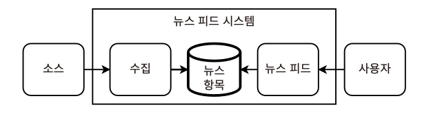
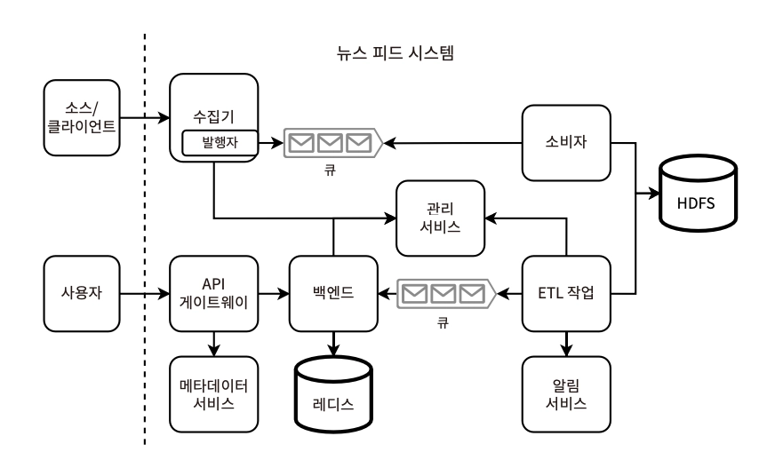
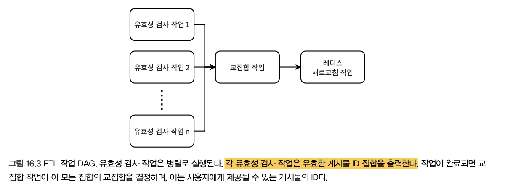
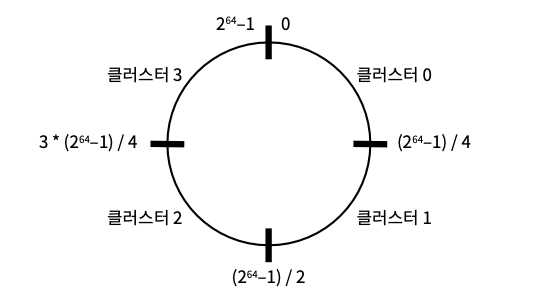
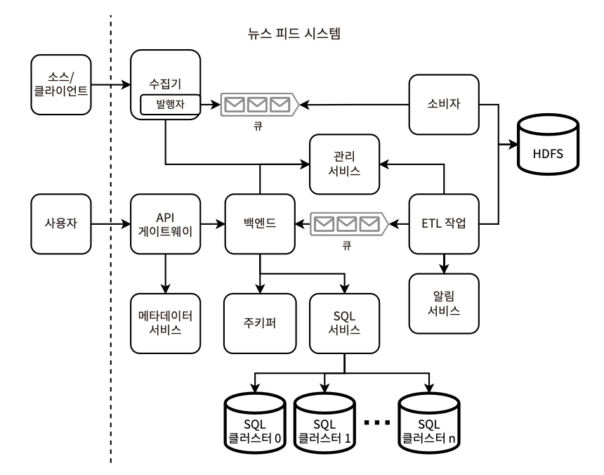
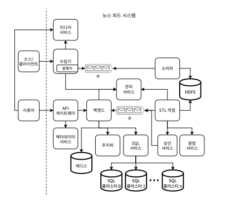

# 16장. 뉴스 피드 설계

> 사용자가 선택한 주제에 속하는 대략적인 시간 역순으로 정렬된 뉴스 항목 목록을 사용자에게 제공하는 뉴스 피드 설계
> 

## 요구사항

### 기능

- 사용자는 관심 주제를 선택할 수 있음
    - 최대 100개의 태그 중 3개까지 선택 가능
- 사용자는 한 번에 10개씩, 최대 1000개씩 영어 뉴스 항목 목록 조회 가능
    - 사용자의 지리적 위치와 무관하게 동일한 항목 반환
    - 이후 위치, 언어 등 개인화 고려
- 최신 뉴스를 먼저 노출 (시간 역순 정렬이 기본)
- 뉴스 항목의 구성 요소
    - 여러 텍스트 필드 (글자 수 제한 존재)
    - 생성 시간 unix timestamp
    - 오디오/이미지/동영상 파일 종류를 고려하지 않음 *시간이 남을 때 최대 1MB의 0~10개 이미지 파일 고려
- 부적절한 내용 포함 등 특정 항목 제외

[고려하지 않는 것]

- 버전 관리
- 관심 주제, 표시된 기사, 읽기로 선택한 기사 등 사용자 데이터 분석/정교한 추천 시스템
- 공유, 댓글 작성 등의 소셜 미디어 기능
- 뉴스의 항목 출처
- 검색은 추후 고려
- 사용자 로그인, 결제, 구독, 광고 등 수익화 → 모든 기사가 무료라고 가정하고 시작

### 비기능

- DAU 10만 명
- 유저당 하루 평균 10회 요청
- 100만 개의 뉴스 항목/일 처리하도록 확장 가능
- 읽기 P99 ≤ 1s
- 사용자 데이터 비공개
- 최대 N시간의 최종 일관성 허용
- 쓰기 고가용성 확보 (읽기는 optional)

## 상위 수준 아키텍처

- 뉴스 출처 → 수집 서비스에 뉴스 항목 제출 → DB에 기록
- 수집 서비스
    - 고가용성
    - 무겁고 예측 불가능한 트래픽 처리
    - 카프카 등 이벤트 스트리밍 플랫폼 사용 고려
- DB
    - 모든 항목 보관
        - 사용자에게는 최대 1000개 항목만 제공
        - ⇒ 보관용 / 사용자 제공용을 분리할 수 있음
    - 사용자 제공 - 1000개 항목 & 100개 태그에 해당하는 전체 뉴스 콘텐츠 크기 = 약 1GB
        - ⇒ Redis 캐시에 쉽게 들어가는 수준
    - 보관용 - HDFS와 같은 분산 샤딩 파일 시스템

**[DB 분리 ver.]**

- 게시물 사용자 요청은 API 게이트웨이를 통하며, 메타데이터 서비스에서 사용자의 태그를 검색 → 백엔드 서비스를 통해 Redis에서 게시물을 검색한다
- 백엔드 호스트가 유휴 상태일 때 큐에서 소비해 Redis를 업데이트 한다  *CQRS
- 수집기의 유효성 검사 작업
    1. SQL 인젝션 방지를 위한 값 검증
    2. 부적절한 언어 감지 등의 필터링, 검열 — 즉시 거부 / 수동 검토 플래그
    3. 게시물이 차단된 출처/사용자로부터 왔는가 
    4. 필수 필드 길이, 최대 길이, 불가능 문자 포함 등 형식 검사
- 특정 출처의 요청 → **인증/인가 서비스**를 거쳐 수집기에 도달하게끔 강제할 수 있다
- 소비자는 큐에서 폴링해 HDFS에 기록
    - 최소 2개의 테이블 필요 - 소비자가 제출한 원시 뉴스 항목 / 사용자에게 제공할 뉴스 항목 / +관리자 수동 검토가 필요한 항목
    - 테이블은 태그와 시간으로 분할됨
- 사용자 기기가 1시간에 1번 이상으로 뉴스 항목을 업데이트할 필요가 없다 (서비스 부하 절감 목적)
    1. 기기에서 요청 무시
    2. 요청은 하나, 응답이 504 Timeout이면 재시도 수행X
- 백엔드 서비스의 유효성 검사
    
    > **뉴스 피드에서 조정 기능은 핵심 역할이므로, 조정 기능을 별도의 단일 조정 서비스로 통합할 수 있다**
    > 
    
    **병렬 ETL 작업으로 처리 가능*
    
    1. 중복 항목 탐색
    2. 지난 1시간 이내에 제출 가능한 특정 태그/주제의 뉴스 항목 수에 제한이 있는 경우
    
    ⇒ 중간 HDFS 테이블의 항목 ID 교집합(=유효성 검사 통과 집합)을 결정하여 최종 HDFS 테이블에 업데이트 → Redis 캐시에 overwrite
    
    
    

## 사전에 피드 준비하기

- (tag, hour) 쌍마다 하나의 redis 쿼리에 대응
    - 사용자가 원하는 항목을 얻기 위해 많은 쿼리를 할수록 읽기 트래픽, 지연 시간 증가
- 사용자의 피드를 사전에 준비하여 미리 대응하자!
    - HashMap
        1. {userId: postId} - 최대 10억 명 사용자 X 100*1000개 게시물 = 최대 800TB
        2. {postId: post} - 약 1GB 이상의 메모리 차지 (100개 태그를 가정할 때)
    - 스토리지 공간 효율화 방안
        1. 사용자를 지역별로 분할 & 데이터 센터 당 2~3개의 지역만 저장함으로써 해결 가능
        2. 샤딩된 SQL 구현하기 (테이블을 해싱된 사용자 ID로 샤딩 → 적절한 SQL 노드로 요청)
            - 테이블은 모든 노드에 복제되며, 이들 간 join 쿼리 수행 가능
            - 초기에는 균등한 분할로 시작 → 불균등한 트래픽에 따라 분할 수, 크기, 호스트의 하드디스크 용량, VM 크기 등 재조정
                - 클러스터로의 트래픽 모니터링에 기반
            
            
            
            64bit 주소 공간에서 4개의 클러스터는 각각 1/4씩 주소 공간을 차지한다
            
            - 적절한 SQL 노드를 찾는 방법
                - 해싱된 사용자 ID - 클러스터명에 매핑
                - 각 클러스터는 팔로워마다 하나씩 여러 A record를 가짐 → 팔로워 노드에 무작위 할당
    - 위 설계를 적용한 아키텍처
        
        
- 클라이언트 종류가 유일하다면, 클라이언트 측에 게시물을 저장해 저장 공간을 절약하는 방법도 있음
    - 한 번만 가져오고 삭제 → 다른 기기에서는 동일한 결과 반환 X (최신의 인기 뉴스를 반환하는 게 더 중요하므로 수용 가능한 정책)
- 타임스탬프 컬럼 추가 → 24시간 초과한 행 주기적으로 삭제하는 ETL 작업도 고려해볼 수 있다
- 클라이언트가 Redis에서 동일한 게시물을 2번 이상 가져오지 않도록 하려면?
    1. 뉴스 피드 조회 API에 postId를 함께 실어서 요청
    2. Redis에서 게시물을 시간별로 레이블링 & 클라이언트는 특정 시간의 게시물을 요청 *게시물이 많을수록 더 작은 시간단위로 쪼개기

## 검증과 콘텐츠 조정

> 게시물의 수동 검토 플래그를 지정하여 승인 서비스를 거치는 절차가 필요한 경우
> 
- 검토자가 게시물을 승인 / 거부
    - `승인`  카프카 큐로 전송 → 백엔드에서 소비
    - `거부` 승인 서비스가 메시징 서비스를 통해 소스/클라이언트에 알림
- 사용자 기기의 게시물 변경
    - 자동화하기 어려운 유효성 검사
        1. 연령 부적합 내용
        2. 가짜 뉴스
        3. 일부 맞춤법 오류
        4. ..
    - 모든 오류와 실패를 방지하려는 접근 X
        - 이를 쉽게 감지하고 문제를 해결하여 수정할 수 있는 메커니즘을 개발하는 것이 더 중요하다
        - e.g. 전달되지 말아야 할 게시물이 전송된 경우 → 이를 삭제하거나 수정된 게시물로 덮어쓰는 메커니즘
- 게시물 태깅
    - 게시물의 검증 실패 시 대응방안
        1. 삭제 → 사용자 경험 저하
        2. 출처에 알리기 ✅
        3. 관리자 수동 검토 → 대규모 수행 시 비용이 많이 드는 작업
    - 전세계적 vs 지역별로 적용되는 규칙 분리 여부
        - 사용자의 명시된 선호도와 연령, 지역 등의 특성에 따라 특정 게시물의 노출을 제한해야 하는 경우가 있다
        - 수집기에는 사용자를 특정할 수 없어 이를 거부할 수 없으며, 대안으로 게시물에 메타데이터 태그를 지정해 각 사용자가 필터링할 수 있게 제공할 수 있다
        - *태그/필터를 업데이트한 시점의 이후 게시물에만 적용된다고 가정 (이전 게시물에 레이블 재지정 고려X)
- Redis 해시 테이블
    1. {post ID, post}: ID로 게시물 가져오기
    2. {tag, [post ID]}: 태그로 게시물 ID 필터링
    3. {post ID, [filter]}: 필터로 게시물 필터링
- 조정 서비스
    - 개발, 유지보수가 중복되고 버그 위험이 높아지지만 다양한 브라우저, 모바일 앱, 수집기에서 동일한 검증을 구현한다
    - 이는 CPU 처리 오버헤드를 높이지만, 서비스 트래픽을 줄여 클러스터의 크기와 비용을 절감할 수 있기 때문
    - 단일 통합 서비스로 조정 기능을 제공하도록 하여 유지보수성을 높일 수 있다
        - 구현 - 뉴스 피드 주제로 produce → 뉴스 피드 서비스에서 consume하여 관련 데이터를 Redis에 쓴다  (*뉴스 피드 서비스의 ETL 작업과 유사한 패턴)

## 로깅, 모니터링, 경보

- 특정 소스로부터의 비정상적으로 많거나 적은 트래픽 비율
    - 항목 업로드 시점의 timestamp VS Redis에 도달한 현재 시간 비교
- 모든 항목과 각 개별 소스 내에서 검증에 실패한 항목의 비정상적으로 높은 비율
- 사용자가 기사를 악용이나 오류로 신고하는 등의 부정적인 사용자 반응

### 텍스트, 이미지로의 확장 지원

- 뉴스 항목 당 0~10개의 1MB 이미지를 지원 & 해당 이미지는 게시물 객체 일부 속성이라고 가정할 때
    - 조회 요청의 부하를 증가시키지 않도록 다른 저장 기술/이미지 처리 라이브러리 사용 및 재사용 전략 등을 고려해볼 수 있다
- 아키텍처
    
    
    
    - 미디어 업로드는 동기식 처리 → 업로드 성공 여부를 즉시 판정할 수 있어야 함
        - 큐에 메타데이터, 텍스트를 생성하기 전에 업로드가 완료되어야 함
        - 업로드 시 미리 수집기에서 파일 해싱 & 업로드 여부를 판단하여 중간에 큐 메시지 생성 실패하더라도 재업로드 X
    - 즉, 수집기 클러스터가 이를 수용할 만큼 커져야 함
    - 미디어는 여러 데이터 센터로 분산
    - 소비자 클러스터는 미디어 서비스 클러스터보다 훨씬 작을 수 있다
    - 부하 분산을 위한 CDN 도입 시 *인기 있는 기사일수록 효과적
        - Redis → 기사 텍스트, 미디어 URL 다운로드 (*데이터가 커질 때 기사ID만 저장하도록 축소될 수 있음)
        - CDN → 미디어 파일 다운로드

## 기타 논의 가능한 주제

- 고정된 주제 집합이 아닌, 동적인 해시태그 생성
- 다른 사용자/그룹과의 뉴스 항목 공유
- 제작자, 독자에게 알림 전송 상세 구현
- 기사의 실시간 배포, ETL 작업을 스트리밍으로 구현
- 특정 기사를 우선시하는 경우

[기능 외]

- 분석
- 개인화된 뉴스 항목 집합 제공
- 영어 외의 언어로 기사 제공 (UTF 처리, 언어 번역 등 고려 필요)
- 뉴스 피드의 수익화
    - 구독 시스템 설계
    - 특정 게시물을 구독자용으로 예약
    - 비구독자를 위한 기사 제한
    - 광고, 프로모션 게시물
