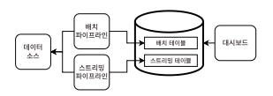
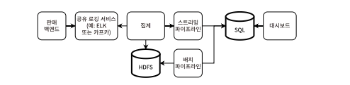
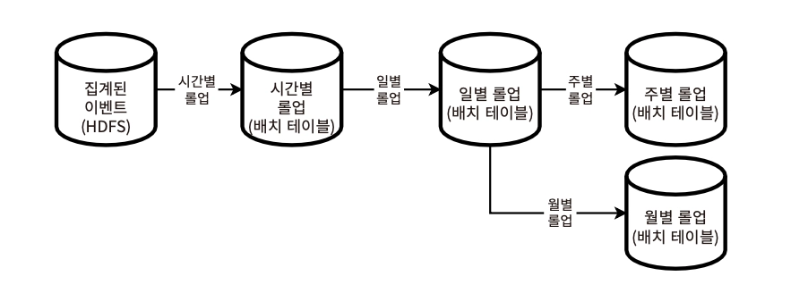
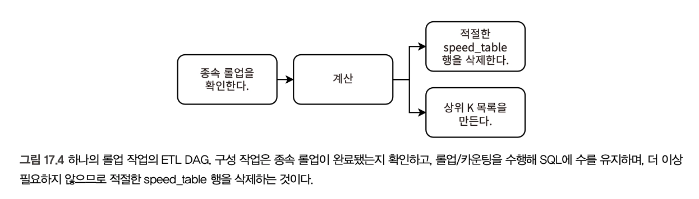
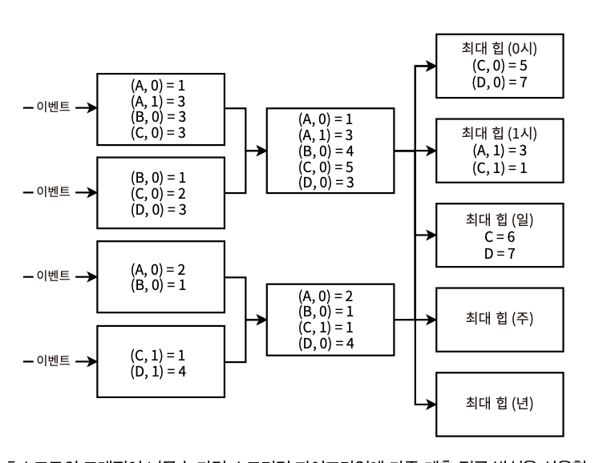
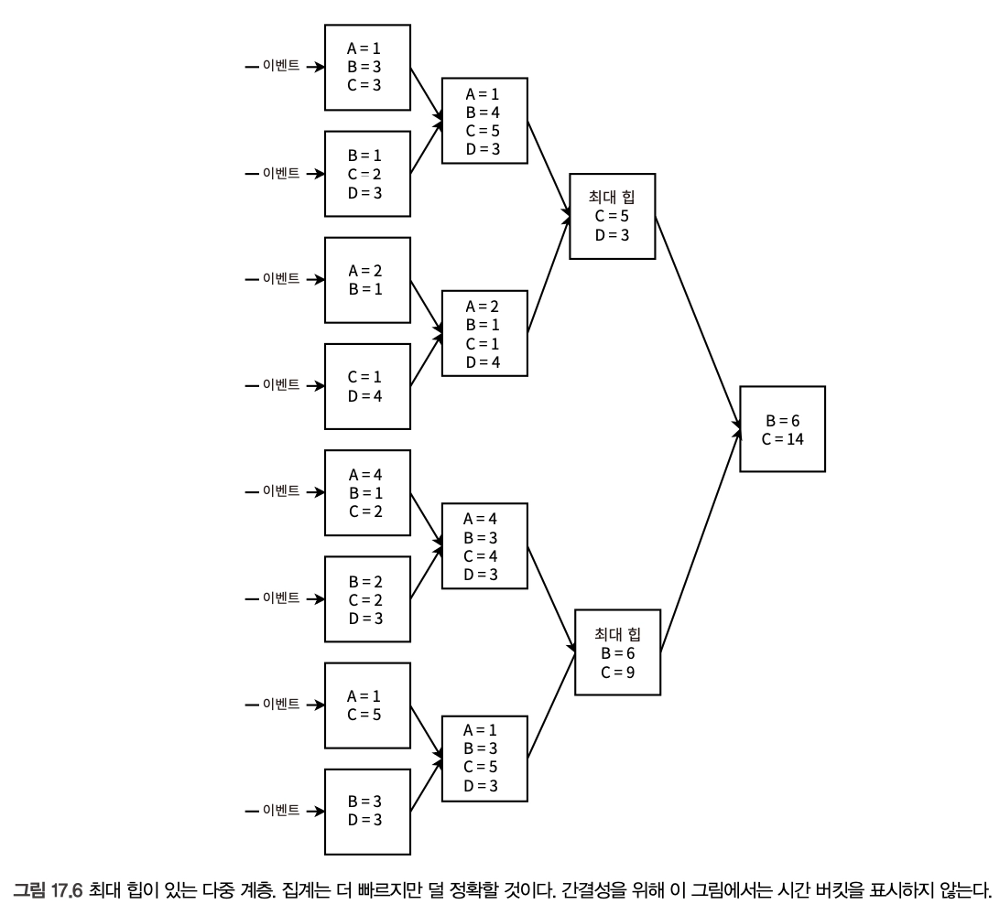

# 17장. 판매량 기준 아마존 상위 10개 제품 대시보드 설계
> ***Top K Problem, Heavy Hitters***
> 
- 특정 네트워크 요청과 사용자 상호작용을 항상 로깅
- 제품의 인기 여부에 따라 홍보 or 단정을 결정
- 상위 K 문제 예시
    - 온라인 쇼핑몰 앱 - 판매량, 수익 기준 최고/최저 판매 제품, 가장 많이/적게 본 제품
    - 앱 스토어 - 가장 많이 다운로드된 앱
    - 비디오 앱 - 가장 많이 본 동영상
    - ..

## 요구사항

### 기능

- 아마존 등 타 온라인 쇼핑몰 앱의 데이터 센터에 접근
    - 동점, 시간 간격 등 고려
    - 특정 주기에 따라 집계
- 상위 K 목록에 표시할 항목
    - 판매 수량, 제품 판매 순위
- 판매 후 발생하는 후속 이벤트 → 무시를 전제
    - 환불 요청
    - 동일/타 제품으로의 교환 요청
    - 제품 리콜

### 비기능

- 정확도 < 확장성, 비용, 복잡성, 유지보수성을 우선시
- 특정 기간 내 특정 상위 K 목록의 계산은 낮은 지연시간, 최종 일관성으로 이루어져도 충분하기 때문
    - 실시간으로 정확한 판매량, 순위를 계산하는 것은 많은 리소스를 필요로 하므로, 람다 아키텍처로 최근 몇 시간 동안의 근사 판매량, 순위를 제공하는 최종 일관성을 택할 수 있음
- 확장성 요구사항
    - 판매 거래 비율
    - 상위 K 문제 대시보드 요청 비율
    - 제품 수량 - 하루 1000억 건의 대량 판매 거래 트래픽을 가정 ⇒ 이벤트당 1KB ⇒ 쓰기 속도 하루 10TB

## 초기 구상 & 고수준 아키텍처

- 상위 K 목록 계산을 위한 데이터 전처리
    - 주기적으로 집계 → 판매량 계산 → 시간/일/주/월/연 단위로 bucketing
    - 판매가 매우 불균등할 수 있으므로 버킷은 저장되어야 함
- 상위 K 목록 취합 단계
    1. 원하는 기간에 따른 적절한 버킷 수 합산
    2. 합산 이후에는 이벤트를 삭제해 저장공간 절약
    3. 합계 정렬 ⇒ 상위 K 목록 반환
- 람다 아키텍처 : 배치+스트리밍을 모두 사용해 대량의 데이터를 처리하는 접근 방식
    
    [구성]
    
    
    
    - 2개의 병렬 데이터 처리 파이프라인
        
        → 판매 거래가 발생하는 모든 데이터 센터에서 실시간으로 이벤트를 수집하고, 근사 알고리즘으로 가장 인기 있는 제품의 판매량과 순위를 계산하는 스트리밍 계층
        
    - 2개의 파이프라인 결과를 결합하는 서빙 계층
        
        → 정확한 판매량과 순위 계산을 위해 시간/일/주/연별 등 주기적으로 실행되는 배치 계층
        
    
    **정확도를 위해 배치 파이프라인의 ETL 결과가 스트리밍 파이프라인의 결과를 덮어쓸 수 있음*
    
    | 구성 요소 | 역할 | 처리 방식 | 특징 |
    | --- | --- | --- | --- |
    | 스트리밍 계층 | 실시간 판매 이벤트를 수집하고 인기 제품 순위 계산 | 각 데이터 센터에서 발생한 판매 이벤트를 실시간 처리 | 근사 알고리즘 사용, 빠르지만 완전 정확하지 않을 수 있음 |
    | 배치 계층 | 정확한 판매량과 순위 계산 | 시간/일/주/연 단위로 주기적 실행 | 전체 데이터를 기준으로 계산하므로 정확도 높음 |
    | 서빙 계층 | 스트리밍 결과와 배치 결과를 결합해 조회 제공 | 두 파이프라인 결과를 합쳐 사용자 요청에 응답 | 빠른 응답과 정확성을 함께 제공 |
- 이벤트는 EDA 접근에 따라 카프카 토픽에 전송

## 집계 서비스



- 초기 최적화 접근
    - 판매 이벤트에 대한 집계 수행 → 집계된 판매 이벤트를 스트리밍과 배치 파이프라인에 전달 → 모두 RDBMS(SQL)에 write
    - 집계를 통해 스트리밍, 배치 파이프라인 클러스터의 크기를 줄인다
    - 집계 서비스 - 판매 이벤트 기록 → 카프카를 통해 HDFS, 스트리밍 파이프라인에 이벤트 flush → 카프카를 구독중인 호스트에서 이를 소비
- 집계 서비스 처리 구조
    
    
    | 영역 | 무엇을 정하는가 | 핵심 내용 | 왜 중요한가 |
    | --- | --- | --- | --- |
    | 입력 데이터 | 어떤 이벤트를 받을지 | 원시 판매 이벤트: `(timestamp, product_id)` | 개별 판매 발생을 집계의 시작점으로 사용 |
    | 집계 결과 | 어떤 형태로 바꿀지 | 집계 이벤트: `(product_id, start_time, end_time, count, aggregation_host_id)` | 제품별·시간별 판매량을 계산하기 위해 필요 |
    | 집계 기준 | 무엇을 기준으로 묶을지 | 제품 ID 기준으로 판매량 집계 | 인기 제품 순위 계산의 기본 단위 |
    | 시간 기준 | 어느 시간 범위로 묶을지 | 같은 시간 구간 안에서만 집계. 예: `01:00~01:10` | 시간별/일별/주별 순위를 정확히 나누기 위해 필요 |
    | 작업 분배 | 어떤 서버가 어떤 제품을 맡을지 | `host_id ↔ product_id` 매핑 | 여러 호스트가 병렬로 집계할 수 있음 
    → **각 호스트가 특정 ID셋을 집계하는 역할** |
    | ㄴ 매핑 관리 | 제품-호스트 관계를 어떻게 바꿀지 | ① 설정 파일
    **② 공유 객체 스토어 파일** ✅
    ****③ DB/Redis
    **④ 사이드카 방식** ✅ |   • 구성 변경 때 전체 클러스터 재시작을 피하기 위해 필요
      • 보통 공유 객체 스토어 파일 또는 사이드카 선택 
      • 단순하면서도 동적으로 변경 가능 (YAML, JSON → HashMap 구조로의 파싱이 쉬움)
      • 구성파일은 대부분 매우 작고, 자주 변경되지 않음 |
    | 책임 분리 | 정확한 timestamp를 어디서 저장할지 | 정확한 timestamp 저장은 **판매 서비스** 책임 | 분석/상위 K 서비스가 판매 서비스의 원천 데이터를 침범하지 않게 함 |
    | **집계 처리** | 호스트 내부에서 무엇을 할지 | `product_id -> count` 해시 테이블을 유지하며 Kafka 이벤트 소비 (토픽에서 이벤트 소비 → 해시 테이블 업데이트를 반복) | 빠르게 판매량을 누적하기 위해 필요 |
    | ㄴ 진행 기록 | 어디까지 처리했는지 어떻게 알지 | 체크포인트를 Redis에 저장 | 장애 발생 후 이어서 처리하거나 재처리 범위를 판단 |
    | ㄴ 플러시 | 누적 결과를 언제 내보낼지 | 일정 주기 또는 메모리 부족 시 집계 결과를 ‘Flush’ Kafka 토픽에 발행
    → CDC를 통해 각 목적지에서 소비 | 메모리 사용을 제한하고 결과를 다음 단계로 전달 |
    | ㄴ 결과 저장 | 집계 결과를 어디에 쓸지 | HDFS와 스트리밍 파이프라인에 기록 | 배치 분석과 실시간 서빙 양쪽에서 사용할 수 있음 |
    | ㄴ 장애 복구 | 실패하면 어떻게 복구할지 | HDFS용, 스트리밍용 체크포인트를 따로 관리 | 한쪽만 성공한 상태에서도 일관성 복구 가능 |
    | ㄴ 중복 방지 | 재처리 시 중복을 어떻게 막을지 | 쓰기 이벤트 ID로 중복 제거 | 실패 후 재시도해도 판매량이 이중 집계되지 않게 함 |
    | 내결함성 | 무엇이 실패할 수 있는지 | 집계 호스트, Redis, HDFS, Kafka, 네트워크 모두 실패 가능 | 실제 운영 환경에서 데이터 유실/불일치를 줄이기 위해 필요 |

## 배치 파이프라인



**점진적으로 시간 간격을 늘려가며 롤업하는 작업의 흐름도**

- 시간/일/주/월/연도별로 롤업 수행
- 다른 간격의 롤업은 점진적으로 행 수를 줄여나가며 이루어짐
- 각 롤업의 결과가 SQL batch_table에 기록되고, 이후 작업에서는 해당 테이블만 읽고 쓰면 됨
- 1개 롤업 작업의 ETL DAG 예시
    
    
    
    - 시간보다 큰 단위의 롤업에서는 종속 롤업 실행이 성공적으로 완료되었음을 확인해야 함
        - 시간 → 일 → 주 → 월 → 연도
        - e.g. 하나의 월별 롤업 실행은 28~30개의 일별 롤업 실행에 종속
    - batch_table의 행 기준으로 상위 K 목록 생성

## 스트리밍 파이프라인

- 배치는 완료까지 시간이 걸리므로, 지연이 모든 간격의 롤업에 영향을 줄 수 있다
- 스트리밍 파이프라인을 통해 근사 기법으로 훨씬 빠르게 수치를 계산하여 다음 롤업, 상위 K 목록 생성을 처리할 수 있다
    - 초기 집계 → 최종 수 계산 → 내림차순 정렬
    - 접근 흐름
        1. 단일 호스트에서 해시 테이블과 크기 K의 최대 힙을 사용해 빈도 수로 정렬. 각 기간마다 버킷 수 초기화
        2. 여러 호스트로의 수평적 확장 
            
            
            
            - 왼쪽 열 → (product, hour) 수 합산 → 중간 열 호스트 → (product, hour) 수 합산 → 오른쪽 열
            - 최종 계층은 각 롤업 간격당 하나의 최대 힙을 포함하는 구조
            - 첫 번째~최종 사이에 계층을 쌓음으로써 트래픽 처리 한계를 결정하는 방식 (집계 서비스의 복잡도를 여기서 처리하게 됨)
            - 제품 ID+타임스탬프 조합의 집계 처리 ⇒ 핫 파티션 키로 사용
                - 상위 K 판매 이벤트 목록에는 정확한 시작~종료 범위가 존재하므로, 타임스탬프가 키로 포함되어야 한다
            - 이벤트가 전체 계층을 통과하는 데 1분 이상 소요될 수 있는데, 이를 비동기로 트리거하기보다 그냥 기다리는 것이 대시보드가 근사치를 표시하는 데 낫다

## 근사

- 집계 서비스의 계층 수를 제한하여 지연을 줄이기 위한 방법
1. 최대 힙만으로 구성된 계층 - 정확도가 낮은 대신 지연과 비용을 줄이는 트레이드오프를 가져감
    
    
    
    - 시스템을 쉽게 프로비저닝하기 위해 별도의 호스트에 구축
    - 해시 테이블 호스트 (자주 변경) / 최대 힙 호스트 (덜 변경)를 별도의 이미지로 말아둔다
        - → 각 호스트에서의 최대 힙을 병합할 수 없어, 최종 상위 K목록은 부정확할 수 있다
2. 카운트-민 스케치 근사 알고리즘
    - 2D 테이블(너비X높이)로 근사 (해시테이블 or 배열로 구현)
    - 너비 = 해시 함수의 수
    - 각 행의 최댓값을 구하고, 해당 최댓값들 중 최솟값을 튀하여 과대 추정 가능성을 줄인다

## 람다 아키텍처를 사용한 대시보드

- 배치 파이프라인, 스트리밍 파이프라인에서 각각 쓴 테이블에 대해, View를 만들어두고 단일 View 의 간단한 SELECT 쿼리로 P99<1s를 달성한다
- e.g. 대시보드 요청 시 top_1000 view 쿼리로 배치 테이블에서 가능한 많은 데이터를 얻고 스트리밍 테이블에서 빈 곳을 채우는 방식

## 카파 아키텍처

- 람다 아키텍처의 단순화 ver.
    
    ```rust
     [Kappa Architecture]
    
            Event
              │
              ▼
          Kafka(Log)
              │
              ▼
       Stream Processing
        (Flink/Kafka Streams)
              │
         ┌────┴────┐
         ▼         ▼
     Dashboard   Serving DB
                 (Redis/DB)
    
    ※ 배치(HDFS, Spark) 없음
    ※ 필요 시 Kafka 로그를 처음부터 다시 읽어(Reprocessing) 재계산
    ```
    
    - 카프카에서 Stream Aggregation(상품ID + 시간단위 집계)을 하여 Top-K 대시보드를 제공할 수 있다
    - **Lambda vs Kappa**
        
        
        | **항목** | **Lambda** | **Kappa** |
        | --- | --- | --- |
        | 파이프라인 | Batch + Stream | Stream 하나 |
        | 코드베이스 | 2개 | 1개 |
        | 운영 복잡도 | 높음 | 낮음 |
        | 처리 방식 | 배치 + 실시간 | 실시간만 |
        | 재처리 | Batch 재실행 | Kafka 로그 Replay |
        | 대량 데이터 | 강점 | 상대적으로 느리고 비용↑ |
        | 실시간성 | Batch 주기 영향 | 즉시 처리 |
        | 장애 영향 | 전체 Batch 실패 가능 | 해당 이벤트만 영향 |
- 핵심 아이디어
    - 모든 데이터는 Kafka에 저장
    - 데이터가 들어오자마자 Stream Processor가 처리
    - 결과를 DB/Redis 등에 저장
    - Dashboard는 계산된 결과만 조회
    - 재계산이 필요하면 Kafka 로그 Replay
- 최근 데이터 → Kafka(Replay) / 오래된 데이터 → S3에 저장하는 방식으로 전략을 세울 수 있다
- 장애 대응 방식 - Stream Processor의 오류율에 따라 Consumer 동작 여부를 결정한다

## **기타 논의 가능한 주제**

- 국가, 도시 등 지역별 Top-K 분리
- 판매량이 아닌 **매출(수익) 기준 Top-K**
- 판매량/매출 **증가율 기준 Top-K**
- 제품명·설명 검색 + 순위/통계 조회
- ML·추천 시스템 등 프로그래밍 API 제공
- 집계 완료 전 **Top-K 근사치 제공**
- 환불·반품·교환 반영한 판매 집계
- 과거 이벤트 재집계(Reprocessing)
- 제품 리콜 등 예외 이벤트 반영
- 데이터 변경 시 Top-K 재생성
- 판매 추세 시각화
- 미래 판매량 예측

**[기능 외]**

- 장기 데이터 보관 전략
- 수년 전 판매 이벤트 조회 최적화
- 대용량 재집계(Reprocessing) 비용
- 메모리 부족(OOM) 대응
- 실시간성과 정확도 트레이드오프
- 검색 시스템 설계
- API 사용자를 위한 확장성·가용성 설계
- 근사 알고리즘(Approximate Top-K) 적용 여부
